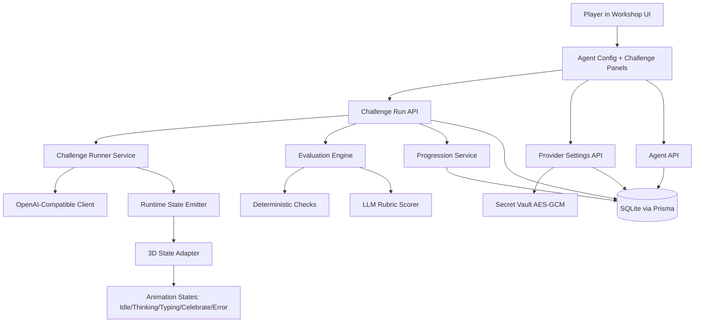

# MVP Workshop Design

**Spec**: `.specs/features/mvp-workshop/spec.md`
**Context**: `.specs/features/mvp-workshop/context.md`
**Status**: Draft

---

## Architecture Overview

The MVP uses a local-first Next.js monolith: UI, API routes, domain logic, and persistence in one deployable app for hackathon reliability. The system separates run execution into deterministic stages so 3D state transitions, evaluation, and progression remain predictable.



---

## Code Reuse Analysis

### Existing Components to Leverage

| Component | Location | How to Use |
| --- | --- | --- |
| Greenfield baseline | N/A | No existing app code in repo; use standard Next.js App Router conventions |
| Workshop concept doc | `AGENT_WORKSHOP.md` | Reuse challenge names, demo arc, and judging mapping narrative |
| Spec requirements | `.specs/features/mvp-workshop/spec.md` | Trace all implementation to requirement IDs |

### Integration Points

| System | Integration Method |
| --- | --- |
| OpenAI-compatible provider | HTTP calls to `/models` and chat completion endpoints via configurable base URL |
| Local persistence | Prisma client over SQLite for agents, runs, progression, provider config |
| 3D assets/animations | Runtime state adapter that emits fixed state enum for animation system |

---

## Components

### ProviderConfigService

- **Purpose**: Store and retrieve global provider settings (base URL + encrypted API key).
- **Location**: `src/lib/provider/provider-config-service.ts`
- **Interfaces**:
  - `getProviderConfig(): Promise<ProviderConfigView>`
  - `saveProviderConfig(input: ProviderConfigInput): Promise<void>`
- **Dependencies**: Prisma client, SecretVault, schema validation.
- **Reuses**: Standard Next.js server module pattern.

### SecretVault

- **Purpose**: Encrypt/decrypt provider API keys at rest using AES-GCM and an env master key.
- **Location**: `src/lib/security/secret-vault.ts`
- **Interfaces**:
  - `encryptSecret(plain: string): EncryptedSecret`
  - `decryptSecret(payload: EncryptedSecret): string`
- **Dependencies**: Node crypto API, env var `MASTER_KEY`.
- **Reuses**: None (new security utility).

### OpenAICompatibleClient

- **Purpose**: Call model discovery and generation endpoints with fallback model behavior.
- **Location**: `src/lib/llm/openai-compatible-client.ts`
- **Interfaces**:
  - `listModels(config: ProviderRuntimeConfig): Promise<ModelInfo[]>`
  - `runChatCompletion(input: ChatRunInput): Promise<ChatRunOutput>`
- **Dependencies**: HTTP fetch, provider config, retry/timeouts.
- **Reuses**: Shared fetch wrapper and zod validators.

### ChallengeCatalog

- **Purpose**: Define the 3 shipped challenges and static scoring metadata.
- **Location**: `src/lib/challenges/catalog.ts`
- **Interfaces**:
  - `getChallengeBySlug(slug: ChallengeSlug): ChallengeDefinition`
  - `listChallenges(): ChallengeDefinition[]`
- **Dependencies**: None.
- **Reuses**: Names and reward framing from `AGENT_WORKSHOP.md`.

### ChallengeRunner

- **Purpose**: Execute a challenge run with selected agent and emit lifecycle states.
- **Location**: `src/lib/runs/challenge-runner.ts`
- **Interfaces**:
  - `runChallenge(input: RunChallengeInput): Promise<RunChallengeResult>`
- **Dependencies**: ChallengeCatalog, OpenAICompatibleClient.
- **Reuses**: ProviderConfigService output.

### EvaluationEngine

- **Purpose**: Produce a final completion decision from deterministic checks + rubric scoring.
- **Location**: `src/lib/eval/evaluation-engine.ts`
- **Interfaces**:
  - `evaluateAttempt(input: EvaluateInput): Promise<EvaluateResult>`
- **Dependencies**: deterministic rules, rubric scorer, merge policy.
- **Reuses**: OpenAICompatibleClient for rubric calls.

### ProgressionService

- **Purpose**: Apply XP, level updates, and unlock events idempotently.
- **Location**: `src/lib/progression/progression-service.ts`
- **Interfaces**:
  - `applyChallengeReward(input: RewardInput): Promise<ProgressSnapshot>`
- **Dependencies**: Prisma client, challenge metadata.
- **Reuses**: ChallengeCatalog reward values.

### Workshop APIs

- **Purpose**: Expose typed API routes for provider config, agents, challenge runs, and demo reset.
- **Location**: `src/app/api/**/route.ts`
- **Interfaces**:
  - `GET/PUT /api/provider`
  - `GET/POST/PATCH /api/agents`
  - `POST /api/challenges/run`
  - `POST /api/demo/reset`
- **Dependencies**: domain services above.
- **Reuses**: zod validation + unified error response helper.

### Workshop UI and 3D Adapter

- **Purpose**: Present control surfaces, run outputs, progression state, and drive 3D animation states.
- **Location**: `src/app/page.tsx`, `src/components/workshop/*`, `src/components/scene/*`
- **Interfaces**:
  - `setRuntimeState(state: RuntimeState): void`
  - `onRunStart/onRunUpdate/onRunComplete` handlers
- **Dependencies**: Workshop APIs, animation contract.
- **Reuses**: Teammate-created 3D assets and clips.

---

## Data Models

### ProviderConfig

```typescript
interface ProviderConfig {
  id: string
  baseUrl: string
  encryptedApiKey: string
  keyIv: string
  keyTag: string
  keyVersion: number
  updatedAt: Date
}
```

### AgentProfile

```typescript
interface AgentProfile {
  id: string
  name: string
  systemPrompt: string
  defaultModel: string
  isPrebuilt: boolean
  createdAt: Date
  updatedAt: Date
}
```

### ChallengeRun

```typescript
interface ChallengeRun {
  id: string
  challengeSlug: 'change-prompt' | 'code-writer' | 'multi-tool'
  agentId: string
  modelUsed: string
  runtimeStateLogJson: string
  outputText: string
  deterministicPass: boolean
  rubricPass: boolean
  finalPass: boolean
  deterministicScore: number
  rubricScore: number
  totalScore: number
  rationale: string
  createdAt: Date
}
```

### ProgressState

```typescript
interface ProgressState {
  id: string
  totalXp: number
  level: number
  unlockedItemsJson: string
  updatedAt: Date
}
```

### ChallengeRewardEvent

```typescript
interface ChallengeRewardEvent {
  id: string
  runId: string
  challengeSlug: string
  xpAwarded: number
  appliedAt: Date
}
```

**Relationships**:

- `ChallengeRun.agentId -> AgentProfile.id`
- `ChallengeRewardEvent.runId -> ChallengeRun.id` (idempotency anchor)
- Single active `ProviderConfig` row and single `ProgressState` row for local demo mode

---

## Error Handling Strategy

| Error Scenario | Handling | User Impact |
| --- | --- | --- |
| Invalid provider key or URL | Block run start, return safe error code, keep secrets redacted | User sees clear setup fix action |
| Provider model list empty/unavailable | Offer fallback `deepseek-v4-flash` and continue | User can still demo model selection flow |
| LLM rubric scoring failure | Mark rubric stage failed and final result fail with rationale | User sees deterministic result + rubric failure reason |
| DB write conflict on reward apply | Use idempotent reward event guard and no duplicate XP | User avoids inflated progression |
| Animation state desync | Force state to `Error` then back to `Idle` on retry | UI remains responsive and recoverable |

---

## Tech Decisions (non-obvious)

| Decision | Choice | Rationale |
| --- | --- | --- |
| App topology | Next.js monolith (UI + API + services) | Minimizes deployment and integration risk in 24 hours |
| Credential scope | Global provider config, not per-agent keys | Faster UX and fewer security/storage edge cases |
| Security method | AES-GCM secret vault with env master key | Strong enough for hackathon + clear answer to judge security questions |
| Evaluation policy | Deterministic pass AND rubric minimum required | Defensible and predictable completion logic |
| Demo reset behavior | Non-destructive reset of transient runtime only | Fast rehearsal loops without reconfiguration overhead |
