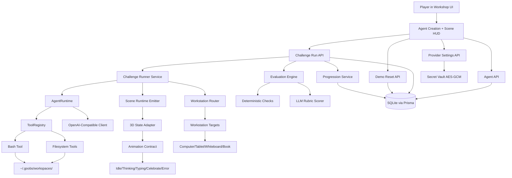

# MVP Workshop Design

**Spec**: `.specs/features/mvp-workshop/spec.md`
**Context**: `.specs/features/mvp-workshop/context.md`
**Status**: Updated (AgentRuntime addition)

---

## Architecture Overview

The MVP uses a local-first Next.js monolith: UI, API routes, domain logic, scene orchestration, and persistence in one deployable app for hackathon reliability. Challenge execution is routed through an orchestration pipeline that also drives workstation assignment and 3D animation transitions.

**New: AgentRuntime layer** introduces a multi-turn tool-use loop between the LLM client and challenge runner. Instead of a single-shot prompt→output flow, the runtime lets the LLM call sandboxed tools (filesystem, bash) over multiple turns, with results fed back into the conversation. A ToolRegistry provides extensibility for future MCP/skills integration.



---

## Code Reuse Analysis

### Existing Components to Leverage

| Component | Location | How to Use |
| --- | --- | --- |
| Greenfield baseline | N/A | No existing app code in repo; use standard Next.js App Router conventions |
| Workshop concept doc | `AGENT_WORKSHOP.md` | Reuse challenge names, workstation idea, and judging narrative |
| Spec requirements | `.specs/features/mvp-workshop/spec.md` | Trace all implementation to requirement IDs |

### Integration Points

| System | Integration Method |
| --- | --- |
| OpenAI-compatible provider | HTTP calls to `/models` and chat completion endpoints via configurable base URL |
| Local persistence | Prisma client over SQLite for agents, runs, progression, provider config, workstation unlock state |
| 3D assets/animations | Runtime state adapter plus workstation routing signals used by scene controller |

---

## Components

### WorkspaceManager

- **Purpose**: Manage sandboxed file system paths under `~/.goobs/` for agent workspaces and per-run artifacts.
- **Location**: `src/lib/runtime/workspace.ts`
- **Interfaces**:
  - `getWorkspacePath(agentId: string): string` — returns `~/.goobs/workspaces/{agentId}/workspace/`
  - `getRunPath(agentId: string, runId: string): string` — returns `~/.goobs/workspaces/{agentId}/runs/{runId}/`
  - `ensureWorkspace(agentId: string): Promise<void>` — creates directories if needed
  - `resolveSafePath(agentId: string, relativePath: string): string` — resolves path and validates it stays within workspace (throws on traversal)
  - `getRunArtifacts(agentId: string, runId: string): Promise<FileManifest[]>` — lists files created during a run
  - `cleanWorkspace(agentId: string): Promise<void>` — remove workspace directories on reset
- **Dependencies**: Node `fs/promises`, `path`
- **Reuses**: N/A (new utility)

### ToolRegistry

- **Purpose**: Extensible registry that maps tool names to handlers, produces OpenAI-compatible tool definitions, and routes tool calls. Designed so MCP servers and skill loaders can be plugged in later without changing the runtime loop.
- **Location**: `src/lib/runtime/tool-registry.ts`
- **Interfaces**:
  - `register(handler: ToolHandler): void` — add a tool handler
  - `getDefinitions(): OpenAIToolDef[]` — merged tool definitions for the LLM request
  - `execute(name: string, args: Record<string, unknown>): Promise<ToolResult>` — route a tool call to its handler
  - `ToolHandler` interface: `{ definitions: OpenAIToolDef[], execute(name, args): Promise<ToolResult> }`
- **Dependencies**: `ToolDefinition`, `ToolResult` types
- **Reuses**: N/A (new core primitive)

### Filesystem Tools

- **Purpose**: Sandboxed file I/O tools (`read_file`, `write_file`, `list_files`) that operate only within the agent's workspace directory.
- **Location**: `src/lib/runtime/tools/filesystem.ts`
- **Interfaces**: `createFilesystemTools(workspaceManager: WorkspaceManager): ToolHandler`
- **Dependencies**: WorkspaceManager, Node `fs/promises`
- **Reuses**: N/A

### Bash Tool

- **Purpose**: Execute bash commands in the agent's workspace directory with timeout enforcement. Returns `{stdout, stderr, exitCode}`.
- **Location**: `src/lib/runtime/tools/bash.ts`
- **Interfaces**: `createBashTool(workspaceManager: WorkspaceManager, timeoutMs?: number): ToolHandler`
- **Dependencies**: WorkspaceManager, Node `child_process.exec`
- **Reuses**: N/A

### AgentRuntime

- **Purpose**: Orchestrate the multi-turn tool-use loop. Builds messages with tool definitions, sends to LLM, executes tool calls, feeds results back, repeats until stop or max turns. Returns final output + tool call log + artifact manifest.
- **Location**: `src/lib/runtime/agent-runtime.ts`
- **Interfaces**:
  - `run(input: AgentRunInput): Promise<AgentRunResult>`
  - `AgentRunInput`: `{ model, systemPrompt, userPrompt, agentId, runId, registry, maxTurns?, useTools? }`
  - `AgentRunResult`: `{ finalContent, toolCallLog, artifacts, turnsUsed, fallbackUsed }`
- **Dependencies**: OpenAI-compatible client (updated), ToolRegistry, WorkspaceManager
- **Reuses**: Existing `runChatCompletion` (updated to support tools parameter)

### Updated: ChallengeRunner

- **Purpose**: Execute a challenge run — now uses AgentRuntime for tool-enabled challenges instead of single-shot LLM. Routes workstation, emits scene events, persists results including tool call logs and artifacts.
- **Location**: `src/lib/runs/challenge-runner.ts` (modified)
- **Interfaces**: `runChallenge(input: RunChallengeInput): Promise<RunChallengeResult>` — unchanged signature; implementation now delegates to AgentRuntime
- **Dependencies**: AgentRuntime, ChallengeCatalog, EvaluationEngine, ProgressionService
- **Reuses**: Existing challenge runner pattern; adds tool layer

### Updated: EvaluationEngine

- **Purpose**: Evaluate challenge attempts — now accepts optional tool call log and artifact manifest for execution-based checks.
- **Location**: `src/lib/eval/evaluation-engine.ts` (modified)
- **Interfaces**: `evaluateAttempt(input: EvaluateInput): EvaluateResult` — adds `toolCallLog` and `artifacts` to input
- **Dependencies**: Deterministic evaluator (updated), rubric scorer
- **Reuses**: Existing evaluation pipeline

### Updated: DeterministicEvaluator

- **Purpose**: Objective checks for each challenge — now checks execution artifacts for Code Writer and Multi-Tool.
- **Location**: `src/lib/eval/deterministic-evaluator.ts` (modified)
- **Interfaces**: `evaluateDeterministic(challenge, output, toolCallLog?): DeterministicResult`
- **Dependencies**: ChallengeCatalog
- **Reuses**: Existing deterministic rule framework

### Updated: OpenAICompatibleClient

- **Purpose**: Call provider endpoints — now supports OpenAI `tools` parameter and handles `tool_calls` in responses.
- **Location**: `src/lib/llm/openai-compatible-client.ts` (modified)
- **Interfaces**: `runChatCompletion(input: ChatRunInput): Promise<ChatRunOutput>` — adds optional `tools` field to input, `toolCalls` to output
- **Dependencies**: ProviderConfigService
- **Reuses**: Existing client structure

### Existing Components (unchanged)

### ProviderConfigService

- **Purpose**: Store and retrieve global provider settings (base URL + encrypted API key).
- **Location**: `src/lib/provider/provider-config-service.ts`
- **Interfaces**:
  - `getProviderConfig(): Promise<ProviderConfigView>`
  - `saveProviderConfig(input: ProviderConfigInput): Promise<void>`
- **Dependencies**: Prisma client, SecretVault, schema validation.
- **Reuses**: Standard Next.js server module pattern.

### SecretVault

- **Purpose**: Encrypt/decrypt provider API keys at rest using AES-GCM and an env master key.
- **Location**: `src/lib/security/secret-vault.ts`
- **Interfaces**:
  - `encryptSecret(plain: string): EncryptedSecret`
  - `decryptSecret(payload: EncryptedSecret): string`
- **Dependencies**: Node crypto API, env var `MASTER_KEY`.
- **Reuses**: None (new security utility).

### OpenAICompatibleClient

- **Purpose**: Call model discovery and generation endpoints with fallback model behavior.
- **Location**: `src/lib/llm/openai-compatible-client.ts`
- **Interfaces**:
  - `listModels(config: ProviderRuntimeConfig): Promise<ModelInfo[]>`
  - `runChatCompletion(input: ChatRunInput): Promise<ChatRunOutput>`
- **Dependencies**: HTTP fetch, provider config, retry/timeouts.
- **Reuses**: Shared fetch wrapper and zod validators.

### ChallengeCatalog

- **Purpose**: Define the 3 shipped challenges and static scoring metadata.
- **Location**: `src/lib/challenges/catalog.ts`
- **Interfaces**:
  - `getChallengeBySlug(slug: ChallengeSlug): ChallengeDefinition`
  - `listChallenges(): ChallengeDefinition[]`
- **Dependencies**: None.
- **Reuses**: Names and rewards from `AGENT_WORKSHOP.md`.

### WorkstationRouter

- **Purpose**: Map challenge/task type to workstation target and required capabilities.
- **Location**: `src/lib/workstations/workstation-router.ts`
- **Interfaces**:
  - `resolveWorkstation(input: WorkstationResolveInput): WorkstationAssignment`
  - `validateAgentCapabilities(input: CapabilityInput): CapabilityResult`
- **Dependencies**: ChallengeCatalog, agent profile metadata, workstation unlock state.
- **Reuses**: Challenge metadata and progression state.

### SceneOrchestrator

- **Purpose**: Coordinate agent spawn, movement, idle state, and workstation animation events.
- **Location**: `src/lib/scene/scene-orchestrator.ts`
- **Interfaces**:
  - `spawnAgent(input: SpawnAgentInput): SceneAgentSnapshot`
  - `routeAgentToWorkstation(input: RouteInput): RoutePlan`
  - `setAgentIdle(agentId: string): void`
- **Dependencies**: WorkstationRouter, runtime state adapter.
- **Reuses**: Animation contract and teammate clip mappings.

### ChallengeRunner

- **Purpose**: Execute a challenge run with selected agent, workstation assignment, and runtime state emission.
- **Location**: `src/lib/runs/challenge-runner.ts`
- **Interfaces**:
  - `runChallenge(input: RunChallengeInput): Promise<RunChallengeResult>`
- **Dependencies**: ChallengeCatalog, OpenAICompatibleClient, WorkstationRouter, SceneOrchestrator.
- **Reuses**: ProviderConfigService output.

### EvaluationEngine

- **Purpose**: Produce a final completion decision from deterministic checks + rubric scoring.
- **Location**: `src/lib/eval/evaluation-engine.ts`
- **Interfaces**:
  - `evaluateAttempt(input: EvaluateInput): Promise<EvaluateResult>`
- **Dependencies**: deterministic rules, rubric scorer, merge policy.
- **Reuses**: OpenAICompatibleClient for rubric calls.

### ProgressionService

- **Purpose**: Apply XP, level updates, workstation unlocks, and reward events idempotently.
- **Location**: `src/lib/progression/progression-service.ts`
- **Interfaces**:
  - `applyChallengeReward(input: RewardInput): Promise<ProgressSnapshot>`
- **Dependencies**: Prisma client, challenge metadata.
- **Reuses**: ChallengeCatalog reward values and workstation unlock rules.

### Workshop APIs

- **Purpose**: Expose typed API routes for provider config, agents, challenge runs, and demo reset.
- **Location**: `src/app/api/**/route.ts`
- **Interfaces**:
  - `GET/PUT /api/provider`
  - `GET/POST/PATCH /api/agents`
  - `POST /api/challenges/run`
  - `POST /api/demo/reset`
- **Dependencies**: domain services above.
- **Reuses**: zod validation + unified error response helper.

### Workshop UI and Scene Layer

- **Purpose**: Render blank isometric plane, display all spawned agents, and show workstation/task progress.
- **Location**: `src/app/page.tsx`, `src/components/workshop/*`, `src/components/scene/*`
- **Interfaces**:
  - `setRuntimeState(state: RuntimeState): void`
  - `routeAgent(agentId: string, workstationId: WorkstationId): void`
  - `onWorkstationUnlocked(workstationId: WorkstationId): void`
- **Dependencies**: Workshop APIs, animation contract, teammate assets/clips.
- **Reuses**: SceneOrchestrator signals.

---

## Data Models

### ProviderConfig

```typescript
interface ProviderConfig {
  id: string
  baseUrl: string
  encryptedApiKey: string
  keyIv: string
  keyTag: string
  keyVersion: number
  updatedAt: Date
}
```

### AgentProfile

```typescript
interface AgentProfile {
  id: string
  name: string
  systemPrompt: string
  skillsJson: string
  toolsJson: string
  defaultModel: string
  modelColorHex: string
  prefersImageTasks: boolean
  isPrebuilt: boolean
  createdAt: Date
  updatedAt: Date
}
```

### WorkstationState

```typescript
interface WorkstationState {
  id: string
  workstationId: 'computer' | 'drawing-tablet' | 'whiteboard' | 'book'
  isUnlocked: boolean
  unlockedAt: Date | null
}
```

### ChallengeRun

```typescript
interface ChallengeRun {
  id: string
  challengeSlug: 'change-prompt' | 'code-writer' | 'multi-tool'
  agentId: string
  workstationId: 'computer' | 'drawing-tablet' | 'whiteboard' | 'book'
  modelUsed: string
  runtimeStateLogJson: string
  outputText: string
  toolCallsJson: string            // NEW: log of all tool calls
  artifactsJson: string            // NEW: list of files created
  deterministicPass: boolean
  rubricPass: boolean
  finalPass: boolean
  deterministicScore: number
  rubricScore: number
  totalScore: number
  rationale: string
  createdAt: Date
}
```

### ProgressState

```typescript
interface ProgressState {
  id: string
  totalXp: number
  level: number
  unlockedItemsJson: string
  unlockedWorkstationsJson: string
  updatedAt: Date
}
```

### ChallengeRewardEvent

```typescript
interface ChallengeRewardEvent {
  id: string
  runId: string
  challengeSlug: string
  xpAwarded: number
  appliedAt: Date
}
```

**Relationships**:

- `ChallengeRun.agentId -> AgentProfile.id`
- `ChallengeRewardEvent.runId -> ChallengeRun.id` (idempotency anchor)
- `ProgressState` drives `WorkstationState` unlock transitions
- Single active `ProviderConfig` row and single `ProgressState` row for local demo mode

---

## Runtime Tool Data Types

### ToolDefinition (OpenAI-compatible)

```typescript
interface ToolDefinition {
  type: "function"
  function: {
    name: string
    description: string
    parameters: Record<string, unknown>  // JSON Schema
  }
}
```

### ToolCall

```typescript
interface ToolCall {
  id: string
  name: string
  arguments: Record<string, unknown>
}

interface ToolResult {
  callId: string
  name: string
  success: boolean
  output: string       // human-readable result or error message
  data?: {            // structured data (e.g. exec_bash returns stdout/stderr/exitCode)
    stdout?: string
    stderr?: string
    exitCode?: number
    files?: string[]
  }
}
```

### ToolHandler (extensible handler interface)

```typescript
interface ToolHandler {
  definitions: ToolDefinition[]
  execute(name: string, args: Record<string, unknown>): Promise<ToolResult>
}
```

### AgentRunResult

```typescript
interface AgentRunResult {
  finalContent: string                  // final LLM text response after all tool turns
  toolCallLog: ToolResult[]             // log of every tool call + result
  artifacts: Array<{ path: string; size: number; kind: "file" | "dir" }>
  turnsUsed: number
  fallbackUsed: boolean                 // true if LLM didn't call tools at all
}
```

---

## Error Handling Strategy

| Error Scenario | Handling | User Impact |
| --- | --- | --- |
| Invalid provider key or URL | Block run start, return safe error code, keep secrets redacted | User sees clear setup fix action |
| Provider model list empty/unavailable | Offer fallback `OpenCode/deepseek-v4-flash` and continue | User can still demo model selection flow |
| Image task with non-image-capable model | Block run and return model capability guidance | User gets clear fix path before retry |
| Required workstation locked | Return unlock requirement and keep scene responsive | User understands progression dependency |
| LLM rubric scoring failure | Mark rubric stage failed and final result fail with rationale | User sees deterministic result + rubric failure reason |
| DB write conflict on reward apply | Use idempotent reward event guard and no duplicate XP | User avoids inflated progression |
| Animation state desync | Force state to `Error` then back to `Idle` on retry | UI remains responsive and recoverable |
| Path traversal in tool call | Reject operation, return safe error to LLM | Agent sees "Operation blocked: path outside workspace" |
| Tool call timeout | Kill process, return exit code 124 to LLM | Agent can retry or adapt |
| Max tool turns exhausted | Return latest content with warning | Run result shows fallback warning |
| Provider doesn't support tools | Fall back to single-shot, mark `fallbackUsed: true` | Challenge evaluates text-only |
| Workspace dir creation fails | Report error, fail run gracefully | User sees actionable error |

---

## Tech Decisions (non-obvious)

| Decision | Choice | Rationale |
| --- | --- | --- |
| App topology | Next.js monolith (UI + API + services) | Minimizes deployment and integration risk in 24 hours |
| Scene style | Blank isometric plane with spawn-in agents | Clear visual baseline and strong demo storytelling |
| Task routing | Workstation-based routing before execution | Makes abstract agent tasks physically understandable |
| Credential scope | Global provider config, not per-agent keys | Faster UX and fewer security/storage edge cases |
| Security method | AES-GCM secret vault with env master key | Strong enough for hackathon + clear answer to judge security questions |
| Fallback model | `OpenCode/deepseek-v4-flash` | Guarantees runnable baseline when model discovery fails |
| Evaluation policy | Deterministic pass AND rubric minimum required | Defensible and predictable completion logic |
| Demo reset behavior | Non-destructive reset of transient runtime only | Fast rehearsal loops without reconfiguration overhead |
| Agent tool architecture | Multi-turn function calling with extendable ToolRegistry | Gives agents real capabilities, extensible to MCP without rewrites |
| Workspace location | `~/.goobs/workspaces/{agentId}/` | Persistent home directory, hackathon-appropriate, no Docker needed |
| Path security | Resolve-then-prefix-check in WorkspaceManager | Prevents directory traversal without chroot complexity |
| Bash timeout | 10s default, `SIGKILL` fallback with `AbortController` | Fast demo, prevents hung agents |
| Tool fallback | Single-shot completion when provider lacks tools support | Graceful degradation for any OpenAI-compatible endpoint |
| Max tool turns | 5 turns default per challenge definition | Prevents infinite loops, sufficient for file-write + execute + iterate |
